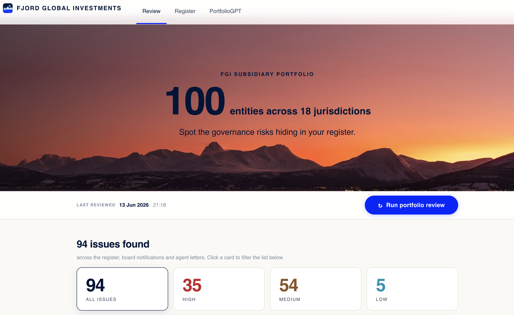
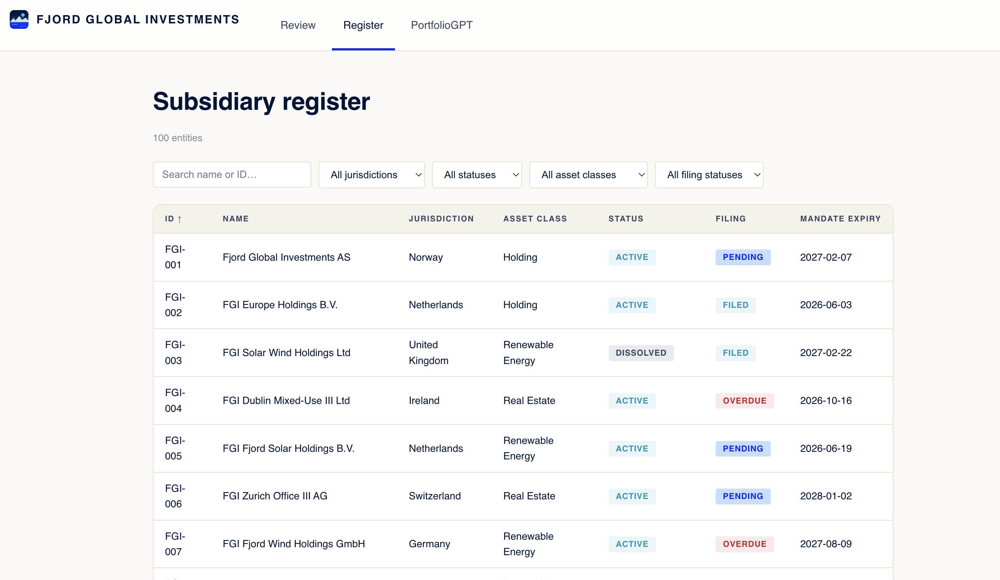
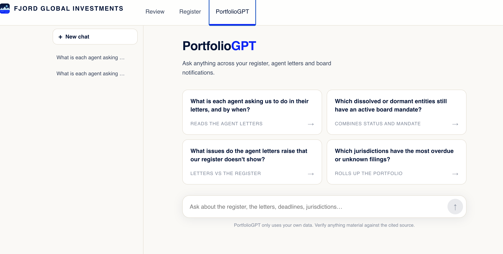

# Fjord Global Investments: Subsidiary Management

An AI tool that ingests FGI's messy governance data (a 100-entity register, ~35
board-change notifications, and 3 agent letters), surfaces the risks the team
can't currently see, and recommends an action for each one.

## What the application does

**Review** is the heart of the tool. One click, and the AI reads all three
sources and lists every governance issue it found, each ranked by risk level
(High / Medium / Low), with a plain explanation and a recommended action.
Where two sources disagree it shows both side by side ("Per the agent letter:
2026-06-19. Per our register: 2028-01-10"), and you can **click the letter to
open the actual PDF with the exact line highlighted**, so every finding is
traceable to its source.


**Register** is the subsidiary register, finally searchable: all 100 entities
in a table you can filter and sort, colour-coded by status. Click any entity
for its full record, who owns it, what it owns, the notifications matched to
it, and any issues found on it. Every finding in Review links here.


**PortfolioGPT** answers natural-language questions across the register, the
agent letters and the board notifications, with its sources cited (and letter
sources open the PDF, same as Review). Conversations are saved, like a chat
app. For example: "What is each agent asking us to do, and by when?" or "Which
dissolved entities still have an active board mandate?"


## How it works

Three stages: get the messy data clean, make it searchable, then let the AI
reason over it. The two AI features read that data in deliberately different
ways (more on that below).

```
   PREPARE             STORE & INDEX        USE IT
   -------             -------------        ------

   CSV  ┐              SQLite  register     REVIEW        reads everything
   JSON ┼──► ingest ─► BM25    keywords ──► PORTFOLIOGPT  retrieves relevant bits
   PDFs ┘              vector  meaning                │
                                                      ▼
                                                   React UI
```

**1. Prepare the data.** Ingest reads the three sources, extracts text from
the PDFs, and normalises the dates (the notifications mix formats, so we pin
them to one calendar). Values are stored as they are, blanks and oddities
included, because the messiness is exactly what we want to flag, not silently
"fix".

**2. Store and index.** The register is structured data, so it lives in SQLite
and is queried with plain SQL. The free-text documents (letters and
notifications) also get two search indexes: a keyword index (BM25) for exact
matches like entity names and legal suffixes, and a vector index (local
embeddings) for meaning-based matches like "compliance problems".

**3. Two AI features, two access patterns.** This is the core design choice,
and the part interviewers tend to ask about:

- **Review** is an exhaustive audit with _no search query_, so it reads
  **everything**: the full register from SQL, plus every letter and
  notification in full. It does **not** use retrieval. For an audit,
  completeness beats relevance, a review that silently skips one entity is
  worse than useless.

- **PortfolioGPT** answers a _specific question_, so it uses **hybrid RAG**: it
  searches both indexes, merges the rankings, and feeds the LLM only the most
  relevant passages. Here relevance is the point, you don't want all 100
  entities in the prompt just to answer one question.

```
   How PortfolioGPT finds the right text (hybrid RAG):

   your question ─┬─► BM25 search    (exact words: names, IDs, "S.à r.l.") ─┐
                  │                                                         ├─► merge ─► top passages ─► LLM answer
                  └─► vector search  (meaning: "compliance problems")      ─┘
```

The two searches catch different things, so we run both and merge the rankings
(reciprocal rank fusion, which needs no score calibration). Full-context Review
works because this dataset is small; at thousands of documents the Review would
move onto this same retrieval path.

### Inside the Review pipeline

One request (`POST /api/digest`) runs the analysis as a series of focused
passes over the full data:

1. **Entity resolution**: match each messy notification name to the register.
   "No match" is a valid answer; every unmatched notification becomes an
   unknown-entity finding.
2. **Register analysis** in three passes: per-entity review (mandates,
   filings, status, record quality), cross-entity structure (duplicate names,
   director concentration), and notification hygiene (duplicates,
   contradictions).
3. **Letter reconciliation**: check which entities each letter names exist in
   the register, then compare the rest field by field to catch disagreements.
4. **De-duplication**: collapse the same issue surfaced by two passes into one.
5. **Recommendations**: one action per finding, plus the executive summary.

**Stack:** FastAPI + SQLite on the backend, React (Vite + TypeScript) on the
frontend styled on nbim.no's design tokens, local embeddings (FAISS), LLMs via
Groq (free open models) with Ollama and Anthropic as options. Tested with
pytest (backend) and Vitest (frontend).

## Running it locally

Prerequisites: Python 3.11+, Node 18+, and a free [Groq API key](https://console.groq.com).
Optional: [Ollama](https://ollama.com) running locally for the unlimited offline fallback.

**Backend** (terminal 1):

```bash
cd backend
python3 -m venv .venv && source .venv/bin/activate
pip install -r ../requirements.txt   # single requirements file at the repo root
cp .env.example .env          # paste your GROQ_API_KEY into .env
uvicorn app.main:app --port 8000
```

The database and search indexes build automatically from `data/` on first start.

**Frontend** (terminal 2):

```bash
cd frontend
npm install
npm run dev
```

Open http://localhost:5173 and press **Run portfolio review**. The first run
takes about a minute; after that, results are cached and instant.

**Tests:** `cd backend && pytest` and `cd frontend && npm test`.
